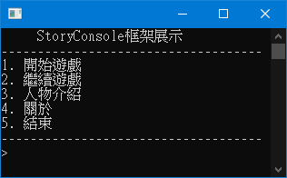

# StoryConsole
Console文字冒險故事框架 \
</img>

### 檔案結構
```
|-StoryConsole.exe -> 框架執行檔
|-Newtonsoft.Json.dll -> JSON函式庫
|-Jint.dll -> javascript引擎
|-save -> 存檔資料夾
|-story -> 故事資料夾
    |-story.json -> 故事標題與故事根進入點
    |-character.json -> 角色介紹
    |-globalVariable.json -> 全域變數檔
```
### JSON檔案說明
#### story.json
```
{
	"name": "故事名稱",
	"startFrom": "故事的第一個檔案(不包含副檔名且必須放在story資料夾中)"
}
```
#### character.json
```
[
	{
		"name": "角色名稱",
		"detailed": "角色介紹"
	},
	...
]
```
#### 全域變數檔
```
[
	{
		"name": "變數名稱，命名規則與javascript一致，注意：在故事的JSON檔中使用時，必須在變數名稱前加上SC.當作前輟",
		"type": "變數型別，可以是string、number、boolean、array、object",
		"value": "變數值"
	},
	...
]
```
#### 故事的JSON檔
##### 主結構
```
[
	{
		"show": "'我是一條指令'"
	}
	...
]
```
##### 可用指令
##### show
```
{
	"show": "故事內容(為javascript運算式)"
}
```
##### select
```
{
	"select": {
		"title": "選項標題(為javascript運算式)",
		"option": [
			{
				"text": "選項(為javascript運算式)",
				"then": [
					{
						"show": "選擇該選項後，要執行的指令"
					}
				]
				...
			},
			...
		]
	}
}
```
##### goto
```
{
	"goto": "跳至的指定的故事JSON檔(不包含副檔名且必須放在story資料夾中)，當為null或空字串時會直接結束遊戲並回到主選單"
}
```
##### sleep
```
{
	"sleep": 過場等待時間(整數且以秒為單位)，也可以是javascript運算式
}
```
##### exec
```
{
	"exec": "執行一段javascript運算式"
}
```

##### if elseif else
```
{
	"if": "一段javascript運算式",
	"then": [
		{
			"show": "'當條件為真時要執行的指令'"
		}
		...
	]
},
{
	"elseif": "一段javascript運算式",
	"then": [
		{
			"show": "'當條件為真要執行的指令'"
		}
		...
	]
},
{
	"else": [
		{
			"show": "'當所有條件都不滿足時要執行的指令'"
		}
		...
	]
}
```
##### while break continue
```
{
	"while":  "一段javascript運算式",
	"then": [
		{
			"show": "'當條件為真要重複執行的指令'"
		},
		{
			"continue": "中斷當次的while，執行下一次while，注意！value，也就是冒號(:)後面接的可以是任何類型，但是不能為null"
		},
		{
			"break": "跳出while，注意！value，也就是冒號(:)後面接的可以是任何類型，但是不能為null"
		}
		...
	]
}
```
